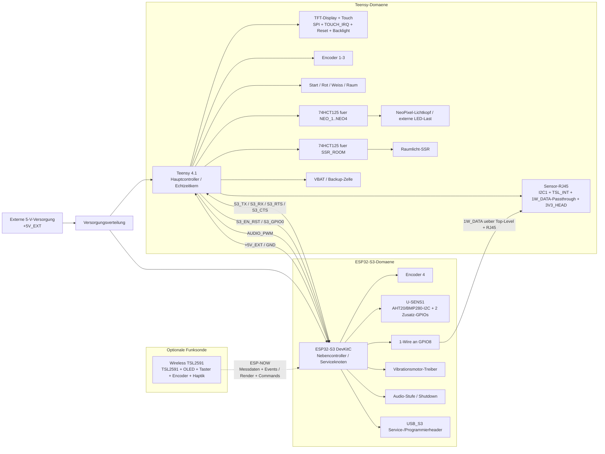

# Duka-Teen Schematic Overview

Quellen fuer diese Auswertung:

- `Duka-Teen.kicad_sch` fuer die Top-Level-Kopplung der Sheets
- `teensy.kicad_sch` fuer U1 `Teensy4.1`
- `ESP.kicad_sch` fuer U2 `ESP32-S3-DevKitC`
- `Wireless TSL2591/include/config.h` als Referenz fuer die externe Funksonde

## Verifizierte Speicherkorrektur: Teensy-PSRAM

Der bisherige Part2-Arbeitsstand ging an mehreren Stellen von `8 MB` externem
PSRAM am Teensy 4.1 aus. Ein isolierter PSRAM-Probe-Sketch auf der aktuellen
Hardware meldet jedoch reproduzierbar `16 MB` ueber den Teensy-Core.

Verbindliche Hardwarevorgabe fuer die aktuelle Duka-Teen-Revision:

- Teensy 4.1 mit `16 MB` externem PSRAM
- grosse, nicht zeitkritische Datenbereiche bevorzugt per `EXTMEM`
- Build-/Diagnosevertrag: `DUKATIMER_TEENSY_PSRAM_MB=16`

Weiterfuehrende Projektregel fuer beide MCUs:

- Vorhandener RAM und PSRAM sind bewusst als Betriebsreserve,
    Schreibentlastung und Pufferraum zu nutzen; Speichersparen ist kein
    Selbstzweck, solange Hot-Path- und Safety-Regeln eingehalten werden.
- Die ausfuehrliche Projektstrategie steht in
    [ram-und-psram-strategie.md](ram-und-psram-strategie.md).

## Wichtige Korrektur: 1-Wire-Topologie

`1W_DATA` ist **nicht** an einem MCU-Pin des Teensy angeschlossen.

Der reale Signalpfad im aktuellen Schaltplan ist:

`ESP32-S3 GPIO8` -> `1W_DATA` -> Top-Level-Sheetkopplung -> Teensy-Sheet als reine Durchleitung -> `J_RJ45_SENSOR1` -> Sensorkopf

Das Teensy-Sheet fuehrt `1W_DATA` also nur zur RJ45-Buchse heraus. Der 1-Wire-Master sitzt am ESP32-S3.

## Optionale Einbindung Wireless TSL2591

Die Wireless-TSL2591-Einheit ist im aktuellen Duka-Teen-Schaltplan nicht als On-Board-Baugruppe enthalten. Sie ist als externes Handmessgeraet zu verstehen und wird nicht ueber die Board-zu-Board-Steckverbinder oder die RJ45-Sensorkopfleitung eingebunden.

Funktionale Rollenverteilung:

- Duka-Teen-Basisgeraet: autoritativer Systemzustand, Mess-Session, Histogramm, Auto-Vorschlaege und Belichtungsentscheidung
- ESP32-S3 auf der Basisplatine: Funk-Gateway fuer ESP-NOW, Weiterleitung von Messdaten und Bedienereignissen
- Wireless-TSL2591-Geraet: externe Sonde mit TSL2591, OLED, Tastern, Encoder und Haptik ohne eigene Papier- oder Belichtungslogik

Die Einbindung erfolgt damit logisch ueber Funk und nicht elektrisch ueber eine neue interne Versorgung oder Datenleitung der Basisplatine.

## Blockdiagramm

Hinweis: Die im Top-Level gefuehrte Leitung `+3.3V` existiert zwar auch im ESP-Sheet, `U2 Pin 2 (3V3)` des `ESP32-S3-DevKitC` ist dort aber mit `no_connect` markiert. Das ESP-DevKit selbst wird im aktuellen Plan also nicht ueber diese Leitung gespeist.

## Top-Level-Kopplung zwischen den Sheets

| Signal | Teensy-Sheet | ESP-Sheet | Bedeutung |
| --- | --- | --- | --- |
| `+5V_EXT` | Output | Input | Gemeinsame 5-V-Versorgung |
| `+3.3V` | Output | Input | 3,3-V-Sheetnetz fuer ESP-seitige Hilfsnetze, nicht direkt fuer `U2 Pin 2 (3V3)` |
| `GND` | Bidirectional | Input | Gemeinsame Masse |
| `S3_TX` | Input | Output | UART vom ESP zum Teensy |
| `S3_RX` | Input | Output | UART vom Teensy zum ESP |
| `S3_RTS` | Input | Output | UART-Handshake vom ESP |
| `S3_CTS` | Input | Output | UART-Handshake zum ESP |
| `S3_EN_RST` | Output | Input | Reset/Enable des ESP vom Teensy aus |
| `S3_GPIO0` | Output | Input | Boot-/Mode-Steuerung des ESP |
| `1W_DATA` | Output im Sheet, intern nur Passthrough | Bidirectional | 1-Wire-Netz; MCU-seitig nur am ESP aktiv genutzt |
| `AUDIO_PWM` | Global Label / Quelle am Teensy | Global Label / Senke in der Audio-Stufe | Audio-PWM vom Teensy zur ESP-Audiostufe |

## U1 Teensy 4.1: verifizierte MCU-Pinzuordnung

Hinweise:

- Die Tabelle listet die im Plan **explizit benannten** U1-Verbindungen.
- `1W_DATA` erscheint absichtlich **nicht** in der U1-Tabelle, weil dieses Signal im Teensy-Sheet nicht an U1 endet.
- Die Symbol-Pins `26` (`34_RX8`) und `27` (`35_TX8`) gehen auf die 2-polige Buchse `J4` und sind dort aktuell als Reserve herausgefuehrt. Im jetzigen Stand ist ihnen keine feste Funktion zugeordnet.

| Symbol-Pin | Teensy-Signal | Netz | Zweck |
| --- | --- | --- | --- |
| `1` | `GND` | `GND` | Masse |
| `2` | `0_RX1_CRX2_CS1` | `S3_EN_RST` | Reset/Enable fuer den ESP32-S3 |
| `3` | `1_TX1_CTX2_MISO1` | `NC` | aktuell unbeschaltet |
| `4` | `2_OUT2` | `ENC1_A` | Encoder 1 Phase A |
| `5` | `3_LRCLK2` | `ENC1_B` | Encoder 1 Phase B |
| `6` | `4_BCLK2` | `ENC1_SW` | Encoder 1 Taster |
| `7` | `5_IN2` | `ENC2_A` | Encoder 2 Phase A |
| `8` | `6_OUT1D` | `TOUCH_CS` | Chip-Select des Touch-Controllers |
| `9` | `7_RX2_OUT1A` | `S3_RTS` | UART-Handshake vom ESP |
| `10` | `8_TX2_IN1` | `S3_CTS` | UART-Handshake zum ESP |
| `11` | `9_OUT1C` | `TFT_DC` | Display D/C |
| `12` | `10_CS_MQSR` | `TFT_CS` | Display CS |
| `13` | `11_MOSI_CTX1` | `SPI_MOSI` | SPI MOSI |
| `14` | `12_MISO_MQSL` | `SPI_MISO` | SPI MISO |
| `15` | `3V3` | `+3.3V` | Lokale 3,3-V-Schiene |
| `16` | `24_A10_TX6_SCL2` | `SSR_ROOM` | Raumlicht-SSR-Steuerung |
| `17` | `25_A11_RX6_SDA2` | `ENC3_A` | Encoder 3 Phase A |
| `18` | `26_A12_MOSI1` | `ENC3_B` | Encoder 3 Phase B |
| `19` | `27_A13_SCK1` | `ENC3_SW` | Encoder 3 Taster |
| `20` | `28_RX7` | `TOUCH_IRQ` | Interrupt des Touch-Controllers |
| `21` | `29_TX7` | `NEO_1` | NeoPixel Datenkanal 1 |
| `22` | `30_CRX3` | `NEO_2` | NeoPixel Datenkanal 2 |
| `23` | `31_CTX3` | `NEO_3` | NeoPixel Datenkanal 3 |
| `24` | `32_OUT1B` | `NEO_4` | NeoPixel Datenkanal 4 |
| `25` | `33_MCLK2` | `BTN_START` | Start-Taster-Eingang |
| `26` | `34_RX8` | `J4 Pin 2` | Reserveleitung auf Buchse J4, aktuell ohne feste Funktion |
| `27` | `35_TX8` | `J4 Pin 1` | Reserveleitung auf Buchse J4, aktuell ohne feste Funktion |
| `28` | `36_CS` | `PIN_BTN_RED` | Taster Rot |
| `29` | `37_CS` | `PIN_BTN_WHITE` | Taster Weiss |
| `30` | `38_CS1_IN1` | `PIN_BTN_ROOM` | Taster Raumlicht |
| `31` | `39_MISO1_OUT1A` | `TSL_INT` | Interrupt vom Sensor-/Messkopf |
| `32` | `40_A16` | `S3_GPIO0` | ESP Boot-/Mode-Steuerung |
| `33` | `41_A17` | `TFT_RST` | Display Reset |
| `34` | `GND` | `GND` | Masse |
| `35` | `13_SCK_LED` | `SPI_SCK` | SPI Clock |
| `36` | `14_A0_TX3_SPDIF_OUT` | `S3_RX` | UART TX des Teensy zum ESP-RX |
| `37` | `15_A1_RX3_SPDIF_IN` | `S3_TX` | UART RX des Teensy vom ESP-TX |
| `38` | `16_A2_RX4_SCL1` | `I2C1_SCL` | Sensor-I2C1 Clock zum Kopf |
| `39` | `17_A3_TX4_SDA1` | `I2C1_SDA` | Sensor-I2C1 Data zum Kopf |
| `40` | `18_A4_SDA` | `I2C0_SDA` | Lokaler/zweiter I2C-Bus Data |
| `41` | `19_A5_SCL` | `I2C0_SCL` | Lokaler/zweiter I2C-Bus Clock |
| `42` | `20_A6_TX5_LRCLK1` | `ENC2_SW` | Encoder 2 Taster |
| `43` | `21_A7_RX5_BCLK1` | `ENC2_B` | Encoder 2 Phase B |
| `44` | `22_A8_CTX1` | `TFT_BL` | Display Backlight |
| `45` | `23_A9_CRX1_MCLK1` | `AUDIO_PWM` | Audio-PWM zur Audiostufe |
| `46` | `3V3` | `+3.3V` | 3,3-V-Ausgang des Teensy |
| `47` | `GND` | `GND` | Masse |
| `48` | `VIN` | `+5V_EXT` | externe 5-V-Zufuhr |
| `49` | `VUSB` | `NC` | aktuell unbeschaltet |
| `50` | `VBAT` | `BT1` | Backup-Zelle fuer RTC/Status |
| `51` | `3V3` | `+3.3V` | 3,3-V-Schiene |
| `52` | `GND` | `GND` | Masse |
| `54` | `ON_OFF` | `SW_ON-OFF1` | Haupt-Ein/Aus |

## U2 ESP32-S3 DevKitC: verifizierte Pinzuordnung

Hinweise:

- Die Tabelle listet die im Plan fuer U2 benannten und funktional genutzten Pins.
- `U2 Pin 2 (3V3)` ist im Schaltplan mit `no_connect` markiert und wird in der aktuellen Revision nicht belegt.
- Mehrere DevKit-Pins sind im aktuellen Plan bewusst unbenutzt und deshalb hier nicht aufgefuehrt.

| DevKit-Pin | ESP32-S3-Pinname | Netz | Zweck |
| --- | --- | --- | --- |
| `3` | `CHIP_PU` | `S3_EN_RST` | Reset/Enable vom Teensy |
| `4` | `GPIO4/ADC1_CH3` | `S3_RTS` | UART-Handshake zum Teensy |
| `5` | `GPIO5/ADC1_CH4` | `S3_CTS` | UART-Handshake vom Teensy empfangen |
| `6` | `GPIO6/ADC1_CH5` | `S3_GPIO06` | Zusatz-GPIO / E_J1 |
| `7` | `GPIO7/ADC1_CH6` | `S3_GPIO07` | Zusatz-GPIO / E_J1 |
| `10` | `GPIO17/ADC2_CH6` | `AUDIO_SHDN` | Audio-Verstaerker/Shutdown-Steuerung |
| `12` | `GPIO8/ADC1_CH7` | `1W_DATA` | 1-Wire zum Sensorkopf |
| `13` | `GPIO3/ADC1_CH2` | `ENC4_A` | Encoder 4 Phase A |
| `15` | `GPIO9/ADC1_CH8` | `S3_GPIO09` | Zusatz-GPIO / E_J1 |
| `16` | `GPIO10/ADC1_CH9` | `S3_GPIO10` | Zusatz-GPIO / E_J1 |
| `17` | `GPIO11/ADC2_CH0` | `SDA_AHT` / `S3_GPIO11-SDA-AHT` | gemeinsame I2C-Datenleitung fuer AHT20 und BMP280 an U-SENS1 |
| `18` | `GPIO12/ADC2_CH1` | `SCL_AHT` / `S3_GPIO12-ACL-AHT` | gemeinsamer I2C-Takt fuer AHT20 und BMP280 an U-SENS1 |
| `19` | `GPIO13/ADC2_CH2` | `S3_GPIO13` | Zusatz-GPIO an U-SENS1 |
| `20` | `GPIO14/ADC2_CH3` | `S3_GPIO14` | Zusatz-GPIO an U-SENS1 |
| `21` | `5V` | `+5V_EXT` | 5-V-Versorgung des DevKitC |
| `25` | `GPIO19/USB_D-` | `USB_S3` | USB D- zum Serviceheader |
| `26` | `GPIO20/USB_D+` | `USB_S3` | USB D+ zum Serviceheader |
| `27` | `GPIO21` | `VIB_PWM` | Vibrationsmotor-Treiber |
| `31` | `GPIO0` | `S3_GPIO0` | Boot-/Mode-Leitung vom Teensy |
| `40` | `GPIO2/ADC1_CH1` | `ENC4_B` | Encoder 4 Phase B |
| `41` | `GPIO1/ADC1_CH0` | `ENC4_SW` | Encoder 4 Taster |
| `42` | `GPIO44/U0RXD` | `S3_RX` | UART RX des ESP vom Teensy |
| `43` | `GPIO43/U0TXD` | `S3_TX` | UART TX des ESP zum Teensy |
| `44` | `GND` | `GND` | Masse |

## Kurzfazit

- Der Teensy ist der Echtzeit- und I/O-Hauptcontroller.
- Der ESP32-S3 uebernimmt Zusatzbedienung, Sensornebenpfade, Audio-/Vibra-Steuerung und den 1-Wire-Bus.
- Die Wireless-TSL2591-Sonde ist als externe Funkbaugruppe einzubinden und haengt nicht an den internen Board-zu-Board- oder RJ45-Signalpfaden.
- Das ESP-DevKit wird im aktuellen Schaltplan ueber `+5V_EXT` gespeist; `U2 Pin 2 (3V3)` ist nicht angeschlossen.
- `1W_DATA` ist elektrisch ein gemeinsames Top-Level-Netz, funktional aber **kein** Teensy-U1-Signal.
